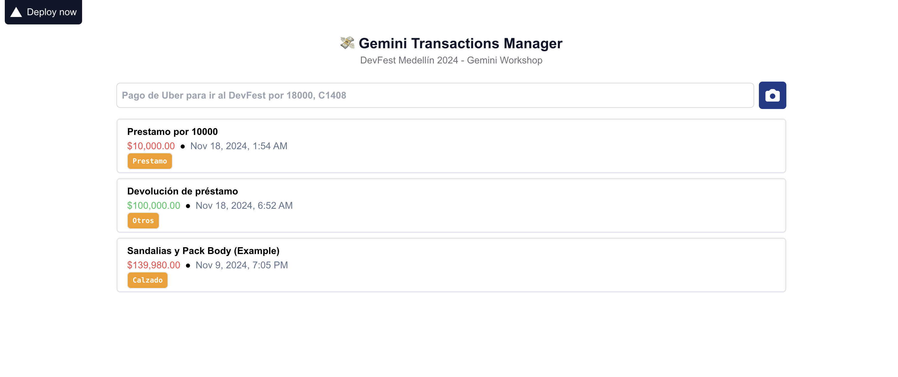

# Level Up Your App with Gemini: A Hands-on Introduction to Function Calling and AI-Powered Data Extraction



Dive into the world of AI and learn how to enhance your app with Gemini's powerful capabilities. In this workshop, you'll work on a practical project, filling in code gaps to create an app that can extract data from both images and text.

You'll leverage Gemini's function calling and multimodal features to automatically process invoices and expense descriptions, storing the extracted information for further analysis. No prior AI experience required!

### App featutes
- Register transaction by picture
- Register transaction by text prompt
- Use functional calling to receive the transaction data

## What you will learn?
- **Gemini Basics**: How to integrate your app with Gemini AI SDK.
- **Multimodal Input**: Learn how to process both images and text using Gemini.
- **Function Calling**: Utilize Gemini's function calling capabilities to integrate with external services.
- **Data Extraction**: Extract relevant information from images (e.g., invoices) and text descriptions using Gemini's AI models.
- **Practical Application**: Build a real-world application that leverages Gemini's power.

## Prerequisites
- [ ] Node.js 20+
- [ ] npm 10+
- [ ] Git CLI
- [ ] Your prefered IDE (Recommended Visual Studio Code)
- [ ] Web camera (Optional)
- [ ] Vercel account to deploy (Optional)

## Getting Started

### Environment file
```properties
GEMINI_API_KEY=[YOUR GEMINI API KEY]
```

### Install dependencies and Run application
```bash
npm i

npm run dev
```

### Your are all set
Open [http://localhost:3000](http://localhost:3000) with your browser to see the result.

You can start editing the page by modifying `app/page.js`. The page auto-updates as you edit the file.

## Challenges
1. Get a Gemini `API KEY` from [Google AI Studio](https://aistudio.google.com/apikey)
1. Create system prompt
1. Declare functions
1. Send prompt and include image
1. Register transaction

## Homework
1. Refactor `extractData`to get `functionCall.name` and invoke the function passing the `functionCall.args`
1. Add persistent storage for transactions. [Firestore](https://firebase.google.com/docs/firestore/quickstart) may be a nice option

## Resources
- [Next.js](https://nextjs.org/docs)
- [Tailwind Dialog](https://www.material-tailwind.com/docs/html/dialog)
- [React Webcam](https://blog.logrocket.com/using-react-webcam-capture-display-images/)
